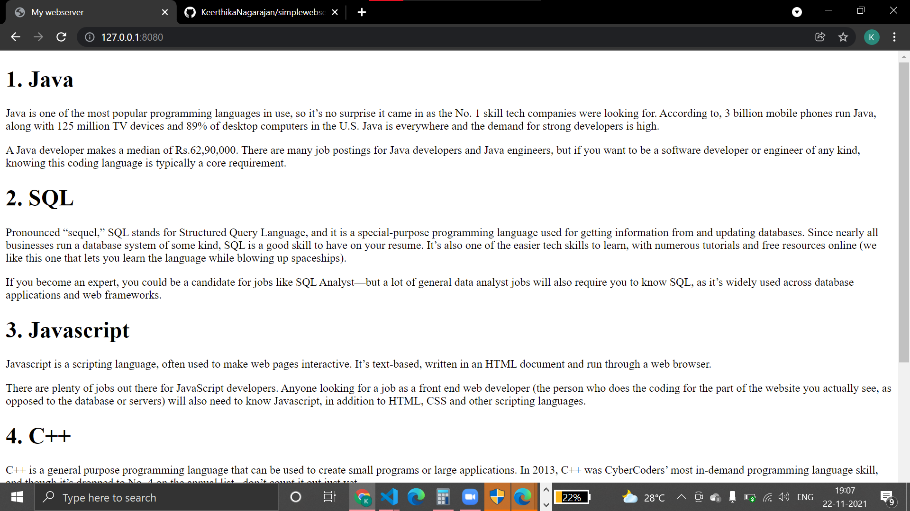
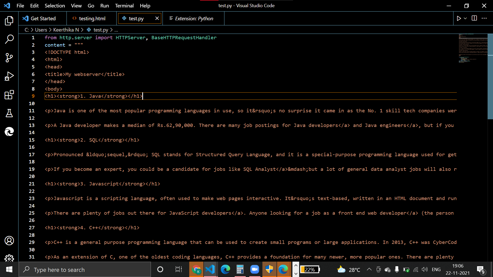

# Developing a Simple Webserver
## AIM:
To display about Top 5 programming languages 

## DESIGN STEPS:
### Step 1: 
HTML content creation
### Step 2:
Design of webserver workflow
### Step 3:
Implementation using Python code
### Step 4:
Serving the HTML pages.
### Step 5:
Testing the webserver

## PROGRAM:
```
from http.server import HTTPServer, BaseHTTPRequestHandler
content = """
<!DOCTYPE html>
<html>
<head>
<title>My webserver</title>
</head>
<body>
<h1><strong>1. Java</strong></h1>

<p>Java is one of the most popular programming languages in use, so it&rsquo;s no surprise it came in as the No. 1 skill tech companies were looking for. According to, 3 billion mobile phones run Java, along with 125 million TV devices and 89% of desktop computers in the U.S. Java is everywhere and the demand for strong developers is high.</p>

<p>A Java developer makes a median of Rs.62,90,000. There are many job postings for Java developers</a> and Java engineers</a>, but if you want to be a software developer or engineer of any kind, knowing this coding language is typically a core requirement.</p>

<h1><strong>2. SQL</strong></h1>

<p>Pronounced &ldquo;sequel,&rdquo; SQL stands for Structured Query Language, and it is a special-purpose programming language used for getting information from and updating databases. Since nearly all businesses run a database system of some kind, SQL is a good skill to have on your resume. It&rsquo;s also one of the easier tech skills to learn, with numerous tutorials and free resources online (we like this one that lets you learn the language while blowing up spaceships</a>).</p>

<p>If you become an expert, you could be a candidate for jobs like SQL Analyst</a>&mdash;but a lot of general data analyst jobs will also require you to know SQL, as it&rsquo;s widely used across database applications and web frameworks.</p>

<h1><strong>3. Javascript</strong></h1>

<p>Javascript is a scripting language, often used to make web pages interactive. It&rsquo;s text-based, written in an HTML document and run through a web browser.</p>

<p>There are plenty of jobs out there for JavaScript developers</a>. Anyone looking for a job as a front end web developer</a> (the person who does the coding for the part of the website you actually see, as opposed to the database or servers) will also need to know Javascript, in addition to HTML, CSS and other scripting languages.</p>

<h1><strong>4. C++</strong></h1>

<p>C++ is a general purpose programming language that can be used to create small programs or large applications. In 2013, C++ was CyberCoders&rsquo; most in-demand programming language skill, and though it&rsquo;s dropped to No. 4 on the annual list, &nbsp;don&rsquo;t count it out just yet.</p>

<p>As an extension of C, one of the oldest coding languages, C++ provides a foundation for many newer, more popular ones. There are plenty of job postings, and it&rsquo;s basically assumed that a candidate for nearly all software engineer or developer jobs will have some experience with the language. Side note: All major Adobe applications are developed in C++.</p>

<h1><strong>5. Python</strong></h1>

<p>Python is a general-purpose, high-level programming language with an emphasis on code readability. It&rsquo;s one of the easier programming languages to learn, with its use of common words and expressions, more white space and fewer curly brackets. It is used by NASA and Reddit, and its web framework, Django, powers the Instagram and Pinterest web apps.</p>

<p>There are many job postings looking for Python/Django developers</a>. Companies seeking Full stack developers (developers comfortable working with both back-end and front-end technologies and numerous programming languages) often list Python as a required language for candidates to have in their arsenal.&nbsp;</p>


<p><span>There are plenty of tech jobs waiting for you, and the more you can get in front of hiring managers and impress them with your mastery of programming languages, the better your odds are of getting the call.&nbsp;</span><span>Need some help?&nbsp;</span>Join Monster for free today</a><span>.&nbsp;</span><span>As a member, you can upload up to five versions of your resume&mdash;each tailored to the types of coding jobs that interest you.&nbsp;Recruiters search Monster every day looking to fill top jobs with qualified candidates, just like you. Additionally, you can get job alerts sent directly to your inbox to cut down on time spent looking through ads. Monster knows how to speak the age-old&nbsp;language of career success.</span></p></h1>
</body>
</html>

"""
class myhandler(BaseHTTPRequestHandler):
    def do_GET(self):
        print("request received")
        self.send_response(200)
        self.send_header('content-type', 'text/html; charset=utf-8')
        self.end_headers()
        self.wfile.write(content.encode())
server_address = ('',8080)
httpd = HTTPServer(server_address,myhandler)
print("my webserver is running...")
httpd.serve_forever()
```


## OUTPUT:

## CLIENT SIDE OUTPUT:


## SERVERSIDE OUTPUT:

## RESULT:

A Simple webserver is developed to display about top 5 programming languages.
